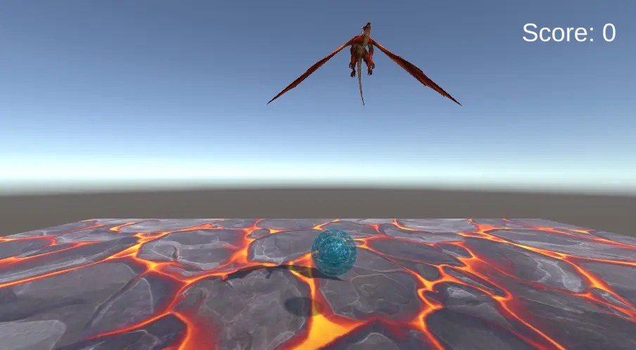

# РАЗРАБОТКА ИГРОВЫХ СЕРВИСОВ
### Ссылка на проект: https://github.com/A-Zaikin/DragonPicker
Отчет по лабораторной работе #3 выполнил:
- Заикин Александр Юрьевич
- РИ300012
Отметка о выполнении заданий (заполняется студентом):

| Задание | Выполнение | Баллы |
| ------ | ------ | ------ |
| Задание 1 | * | 60 |
| Задание 2 | * | 20 |
| Задание 3 | * | 20 |

знак "*" - задание выполнено; знак "#" - задание не выполнено;

Работу проверили:
- к.т.н., доцент Денисов Д.В.
- к.э.н., доцент Панов М.А.
- ст. преп., Фадеев В.О.

## Цель работы
Интеграция интерфейса пользователя в разрабатываемое интерактивное приложение.

## Задание 1
### Используя видео-материалы практических работ 1-5 повторить реализацию игровых механик.
Ход работы:
#### Работа 1: «Реализация механизма ловли объектов»
1)	Добавить в EnergyShield скрипт движения:
```cs
using UnityEngine;

namespace DragonPicker
{
    [RequireComponent(typeof(Rigidbody))]
    public class EnergyShieldMovement : MonoBehaviour
    {
        [SerializeField] private float speedMultiplier;

        private Vector3 mousePosition;
        private new Rigidbody rigidbody;

        private void Awake()
        {
            rigidbody = GetComponent<Rigidbody>();
        }

        private void Update()
        {
            mousePosition = Input.mousePosition;
        }

        private void FixedUpdate()
        {
            var distanceToCamera = transform.position.z - Camera.main.transform.position.z;
            var relativeMousePosition = mousePosition + distanceToCamera * Vector3.forward;
            var goalPosition = Camera.main.ScreenToWorldPoint(relativeMousePosition);
            rigidbody.AddForce((goalPosition.x - transform.position.x) * speedMultiplier * Vector3.right);
        }
    }
}
```

2) Поставить префабу яица тег Dragon Egg.
3) Изменить код яица, чтобы он сам взрывался только об землю.
4) Добавить в EnergyShield скрипт подбора яица:
```cs
using UnityEngine;

namespace DragonPicker
{
    [RequireComponent(typeof(Collider))]
    public class EnergyShieldCollision : MonoBehaviour
    {
        [SerializeField] private GameObject effectPrefab;

        private void OnCollisionEnter(Collision collision)
        {
            var effect = Instantiate(effectPrefab, transform);
            effect.transform.position = collision.GetContact(0).point;

            if (collision.gameObject.CompareTag("Dragon Egg"))
            {
                Destroy(collision.gameObject);
            }
        }
    }
}
```
5) Добавить в Canvas новый TextField для счёта, расположить его в правом верхнем углу экрана.
   


#### Работа 2: «Реализация графического интерфейса с добавлением счетчика очков»
1) Создаём в сцене пустой объект GameplayManager и делаем его синглтоном:
```cs
using UnityEngine;

namespace DragonPicker
{
    public class GameplayManager : MonoBehaviour
    {
        public static GameplayManager Instance { get; private set; }

        private void Awake()
        {
            if (Instance != null && Instance != this)
            {
                Destroy(this);
            }
            else
            {
                Instance = this;
            }
        }
    }
}
```
2) Добавляем в него функции, которые изменяют глобальный state игры:
```cs
[SerializeField] private TextMeshProUGUI scoreLabel;
private int score;

// ...

public void IncreaseScore()
{
    score++;
    scoreLabel.text = $"Score: {score}";
}

public void ClearEggsOnScreen()
{
    var eggs = GameObject.FindGameObjectsWithTag("Dragon Egg");
    foreach(var egg in eggs)
    {
        egg.GetComponent<EggExplosion>().Explode();
    }
}
```
3) Вызываем эти функции соответственно из щита при подбирании яица и из яица при столкновении с землёй.



## Задание 2
Ход работы:
#### Работа 3: «Уменьшение жизни. Добавление текстур»
1) Добавляем в GameplayManager код создания щита произвольного размера:
```cs
private void CreateShield()
{
    for (var i = 0; i < startHealth; i++)
    {
        var layer = Instantiate(energyShieldLayerPrefab, energyShield.transform);
        layer.transform.localScale *= (i + 1) * shieldLayerRadius * 2;
        energyShieldLayers.Add(layer);
    }
    energyShield.GetComponent<SphereCollider>().radius = startHealth * shieldLayerRadius;
}
```
2) Добавлям код уменьшения жизней и рестарта сцены:
```cs
public void OnEggMissed()
{
    var eggs = GameObject.FindGameObjectsWithTag("Dragon Egg");
    foreach (var egg in eggs)
    {
        egg.GetComponent<EggExplosion>().Explode();
    }

    Destroy(energyShieldLayers[^1]);
    energyShieldLayers.RemoveAt(energyShieldLayers.Count - 1);
    energyShield.GetComponent<SphereCollider>().radius = energyShieldLayers.Count * shieldLayerRadius;

    if (energyShieldLayers.Count == 0)
    {
        SceneManager.LoadScene("MainScene");
    }
}
```

3) Импортируем и добавляем на сцену ассет skybox.
4) Добавляем текстовое поле с "Defeat", которое появляется после поражения на несколько секунд.


#### Работа 4: «Структурирование исходных файлов в папке»
1) Все использованные сторонние ассеты с зависимостями (пкм -> Select Dependencies) были перенесены в соответствующие папки проекта.
2) Папки с оставшимися импортированными ассетами были удалены.
3) Ассеты проекта были отсортированы по принадлежности к объекту. Отсортировать ассеты по типу можно при вводе в поиск t:prefab или t:material или т.п.

## Задание 3
Ход работы:
#### Работа 5: «Интеграция игровых сервисов в готовое приложение»

1) Подключение SDK и загрузка приложения на Яндекс Игры уже были проведены в лабораторной работе #2: https://github.com/A-Zaikin/Game-Services-Dev-lab2#задание-2
2) Ссылка на последний билд игры: https://yandex.ru/games/app/197771?draft=true&lang=ru


## Выводы

Изучены:
- интеграция интерфейса пользователя в разрабатываемое интерактивное приложение,
- способы изменения глобального состояния игры и отображения его в интерфейсе,
- техники структурирования исходных файлов проекта,
- возможные виды интеграции игровых сервисов в приложение.

## Powered by

**BigDigital Team: Denisov | Fadeev | Panov**
